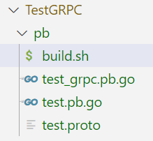

# ECDS

This is an Erasure Coded Decentralized Storage System. ECDS implements functions such as encoded file writing, complete reading, single data block updating, and asynchronous storage auditing. 

The installation and testing steps for ECDS are as follows.

## 1 Install gRPC 

The golang-grpc package provides a library about gRPC. 

The installation command is: `go get -u google.golang.org/grpc`

NOTICE: Before installing gRPC, you should already install go by commands `apt update`and `apt install golang-go`. If faild with `server misbehaving`, execute `export GOPROXY=https://goproxy.cn,direct` and re-execute the installation command.

## 2 Install Protocol Buffers

Protocol Buffers is a language-neutral, platform-neutral, extensible mechanism for serializing structured data and is used as a data exchange format. gRPC uses protoc as the protocol processing tool.

Setp1. Install two packages to support the processing of protobuf files:

```
go get -u github.com/golang/protobuf
go get -u github.com/golang/protobuf/protoc-gen-go
```

Step2. Download the package corresponding to the current system: `protoc-26.1-linux-x86_64.zip`，download URL: https://github.com/protocolbuffers/protobuf/releases

Step3. Extract and set the system PATH. Copy `bin/ptotoc.exe` to `/root/pkg/protoc/bin`，configure the system PATH using the commond `export PATH=/root/pkg/protoc/bin:$PATH`.

Step4. Test proto compilation. Create a file named `test.proto` in a directory of your project and write the following code. Execute the command `protoc --go_out=. --go-grpc_out=. test.proto` to generate two files `test_grpc.pb.go` and `test.pb.go` in the same directory.

```go
syntax = "proto3";

option go_package = "./";

service MyService {
    rpc Process(Request) returns (Response);
}

message Request {
    string message = 1;
}

message Response {
    string result = 1;
}
```

NOTICE：①`option go_package = "./";` means that the output directory is the directory where `test.proto` is located,If it is `option go_package = "./pb";`, then a `pb` directory will be created in the directory where `test.proto`is located; ② If you encounter the error `plugins are not supported`, you can try resolving it by downloading the latest version. The command is `go install google.golang.org/grpc/cmd/protoc-gen-go-grpc@latest`; ③You can use a `.sh` script to compile `.proto` files. For example, create `build.sh` and input the following code. Then, use command `chmod +x build.sh` to add execute permissions and using command `./build.sh` to execute the script.

```bash
#!/bin/bash

# Execute the protoc command to generate Go and gRPC code.
protoc --go_out=. --go-grpc_out=. test.proto
```

The result after executing the script is as shown in the following image:



## 3 Install PBC

The Pairing-Based Cryptography (PBC) is a cryptographic library specifically designed to handle pairing operations. These operations are commonly used to construct cryptographic schemes based on bilinear maps, such as identity authentication, signatures, and other encryption schemes.

Step1. Two dependencies need installed before installing PBC:

```
sudo apt-get install libgmp-dev
sudo apt-get install build-essential flex bison
```

NOTICE: If meeting error `E: Unable to fetch some archives, maybe run apt-get update or try with --fix-missing?`, execute `apt-get update` and then re-execute the command.

Step2. Download PBC package and install it. Download url: `https://crypto.stanford.edu/pbc/download.html`. Download pbc version is `pbc-0.5.14.tar.gz`. Extract it and `cd pbc-0.5.14`, then execute `./configure`, then execute `make` and `make install`. After installation, rebuild the search library path: `ldconfig`.

## 4 Test ECDS

Step1. Start the storage nodes: `cd testgo` and then `go run XX_stornode_main.go`.

Step2. Start the auditor node: `cd testgo` and then `go run XX_auditor_main.go`.

Step3. Start the clients: `cd testgo` and then `go run XX_client_main.go`.

## 5 Deploying and Conduct Experiments In Ucloud

We start 33 instances in Ucloud, each equipped with 4 core CPUs and 64GB of storage space, of which 31 are used as DSN storage nodes, one as the auditor, and one as clients.

The deployment steps are as follows:

Step 1. Create an AC machine with the mirror image. Run `getacaddr.sh` in AC to configure auditor ip address.

Step 2. Make the AC machine into a mirror image.

Step 3. Create a Client machine and 4 machines for SNs (8,8,8,7 instances in the machines with 100G disk) with the mirror image.

Step 4. Manually copy the intranet IPs of SNs from the webpage to `/home/ubuntu/ECDS/data/snips` in AC. Note that the `snips` cannot have empty lines at the end of the file.

Step 5. Modify the AC_IP, Client_IP, ipNum, and portNums in `deploy2.sh` of AC, and then `./deploy2.sh`. VSCode check: There is a `snaddrs` file on the Client containing the ip-ports for SNs, and there is a `snaddrs` file on each SN containing its own ip-port.

Step 6. Modify the Client_IP and snmNum in `run.sh` of AC, and then conduct experiments: `./run.sh`. The exexcution state is shown in `/home/ubuntu/ECDS/data/snlog/` of SN and `/home/ubuntu/ECDS/data/output_ac.log` of AC. Find results in `/home/ubuntu/ECDS/data/outlog_client` of Client and `/home/ubuntu/ECDS/data/outlog_ac` of AC.

Note that all the above paths need to be set according to the specific machine, and all paths and passwords in files `deploy2.sh`, `run.sh`, `startSNs.sh`, `startAC.sh`, `startClient.sh`, `exp_sn.sh`, `exp_ac.sh`, `exp_client.sh` should also be adjusted accordingly.